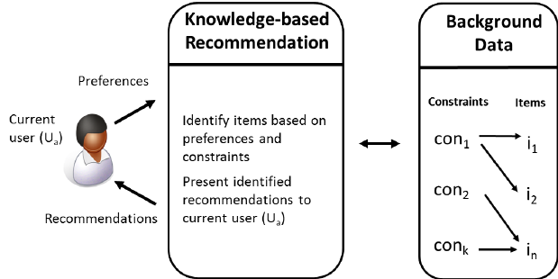

# Knowledge-Based Recommendation Engine

   

Knowledge-Based Recommendations
A knowledge-based recommendation is one in which knowledge about the item or user preferences is used to make a recommendation. Often times, a rank-based algorithm is provided along with knowledge-based recommendations to bring the most popular items in particular categories to the user's attention.

This type of recommendation system is less personalized than other types of recommendation systems. 
